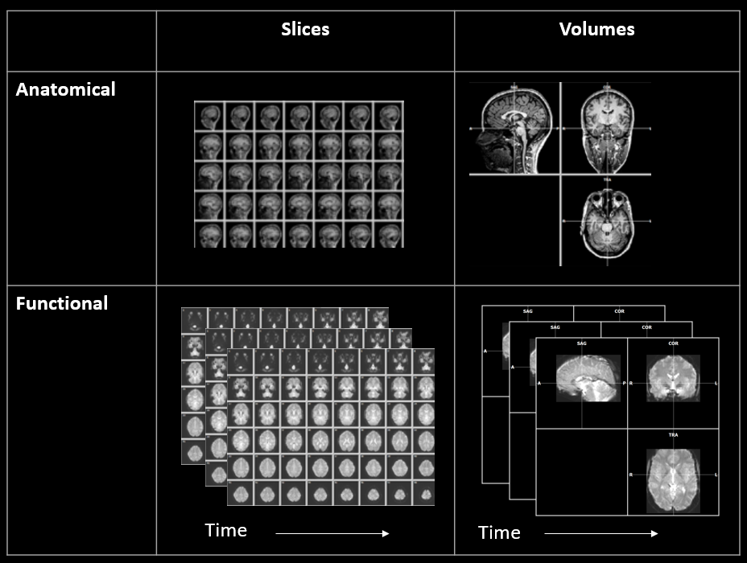

# fMRI/The BOLD Signal

Now that you are all at least semi-pros on how MRI physics work, we can now go from structural to functional. **Functional Magnetic Resonance Imaging(fMRI)** uses the same imaging system as MRI, but we use *different image acquisition parameters* so that we can track changes in the brain over a short period of time. 

fMRI works almost the same as structural MRI, but has two key differences:
1. Higher temporal resolution (images are taken more frequently)
      - Instead of one high resolution image being taken over several minutes like a structural MRI, functional MRI takes several lower resolution MRI scans every couple of seconds
      - Typically in the range of 1.25-3.5 seconds (but can be outside of this) and depends on the image acquisition parameters
2. There is lower spatial resolution (larger voxel sizes, worse SNR)
      - With a lower TR, typically comes lower spatial resolution or SNR
      - Lower spatial resolution isn't "bad" spatial resolution, but it can be a limiting factor for some theories

*So, how can we take a picture and tell what parts of the brain are active?* Well for starters, you **can't** do this with the naked eye. If you look at a montage of fMRI images(in the image below), you will likely see a heterogenous gray blob on your screen that looks like a mix between a Rorsharch Test and a brain. However, when we use complex computer programs, we are able to see what parts of the brain are active for certain tasks or *even at rest*.

- ***Sidebar:*** *Even when you are at rest, certain parts of your brain are ***still*** active. One common view of brain function is the network approach. This means that there are regions are groups that work together to do different things (there is a lot of nuance when talking about brain networks, so I will save the nitty gritty on this for later). The network typically associated with the brain at a resting state is the* ***Default Mode Network(DMN)*** *- one way to think about the DMN is as your internal dialogue (and as with most things in this course, there is a lot more too it). For example, when you are sitting in a waiting room, ***not*** on your phone, you're mind isn't just truly blank - you have thoughts! Maybe it's thinking about how much fun you had learning about fMRI research or how tired you feel even after drinking that large coffee or anything else(I think you get the idea). This is due to the DMN.*

*Image showing the difference between anatomical and functional MRI scans (Image from: https://www.newbi4fmri.com/tutorial-1-data)*
      

*Now, what exactly are these programs seeing for us?* The **Blood Oxygenation Level Dependent (BOLD) Signal** of course! The BOLD signal shows changes in blood flow and blood volume in certain areas, which is used as an *indirect indicator* of neural activity. 

But neurons use electrochemical signals not blood, *right*? Yes, that is correct. However, our neurons are energy powerhouses that use a *lot* of glucose and oxygen, so when a neuron goes from inactive to active, it needs some way to get more of these nutrients that it is quickly using. Luckily, our bodies are very smart, efficient machines. In order to provide the necessary amount of glucose and oxygen to those neurons, the brain redirects more bloodflow to areas those areas. The opposite goes for areas that are not active; they receieve less bloodflow. 

***This is the above information in simpler terms*** 
- Different parts of your brain are active for different tasks, and when you go from doing *nothing* to doing *something*, certain regions go from inactive to active(aka neurons go from not firing, to firing)
- Neurons use a lot of glucose and oxygen, so as soon as they become active, they need a lot more glucose and oxygen
- These molecules are transported through the blood and our bodies are smart, so to solve this problem, blood flow will be redirected to brain regions that need more nutrients
- Lastly and most importantly, in the fMRI images we can see the difference in levels of oxygenation of blood due to biochemistry and physics that are too complicated for this
- We can use these images to see what parts of the brain are active at certain times during the scan (indirectly using the signal from the blood flow, or BOLD signal) 

While you may not find this video to be the most exhilarating, it is packed with useful information and very well done. This covers all of the basics in measuring the bold signal, HRF, and factors that can affect scans.

    <a href="https://youtu.be/jG2WQpgpnMs?si=l3bg7cT2EGPDXMgC" border="10" style="padding: 10px 20px; background-color: #007bff; color: white; text-decoration: none; border-radius: 100px;"> Principles of fMRI Part 1, Module 8: fMRI Signal & BOLD Physiology </a>

  
This video really helps tie together some of the more practical aspects of MRI images that are relevant to know about: 
  
  

    <a href="https://www.youtube.com/watch?v=yA65FuSpOMs&list=PLyGKBDfnk-iDVpUGSR_GlDmQrZOS0Lk6k&index=1&t=1s" style="padding: 10px 20px; background-color: #007bff; color: white; text-decoration: none; border-radius: 100px;"> fMRI Bootcamp Part 1 - Basics of MRI </a>

 ------------------------------------------------------------------------------------------------

 

  <a href="what_is_an_mri.html">Last Page - (What is an MRI)</a>
  <a href="hrf.html">Next Page - (HRF)</a>

  <a href="/fmri-for-beginners/">Home</a>

