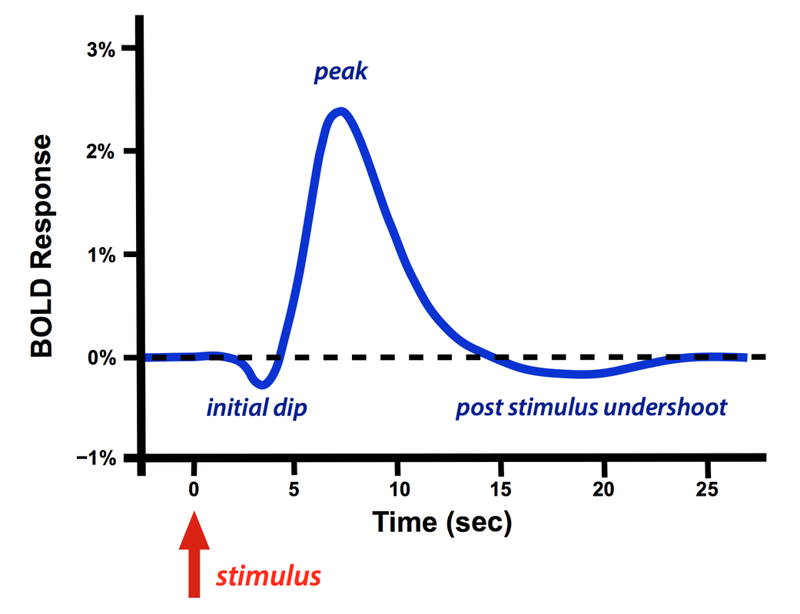

# Hemodynamic Response Function (HRF)

So now you know that we're measuring changes in blood flow, but this is not a process that happens instantaneously. It is theorized that once neurons fire, the measurable BOLD signal does not appear until 4-6 seconds after. Not only that, but we are limited by our TR which is typically greater than 2 seconds - we can only see what is happening every 2 seconds. 

*What about the things that happen during those 2 seconds and how do we account for the difference in tme?* Those are still important, but since we can't directly measure that, we must use statistical models to do our best to estimate it. The **HRF** is a statistical model of the BOLD signal in response to stimuli. It is estimated that after a region becomes active, the change in blood flow isn't measurable until about 4-6 seconds after. Below is a figure that shows what this reponse would look like. 

*Image from: https://mriquestions.com/does-boldbrain-activity.html*

### Application
This lecture does an incredible job at introducing you to the HRF and explaining how we use it to analyze fMRI data.

  <a href="https://youtu.be/SsJjuJJjNHM?si=7IcWpTotJXR7VEGr" style="padding: 10px 20px; background-color: #007bff; color: white; text-decoration: none; border-radius: 100px;">fMRI Bootcamp Part 2 - fMRI Timecourse
 </a>

 ------------------------------------------------------------------------------------------------
 
 

  <a href="glm.html">Last Page - (GLM)</a>
  <a href="neuroanatomy.html">Next Page - (Neuroanatomy) </a>

  <a href="/fmri-for-beginners/">Home</a>

