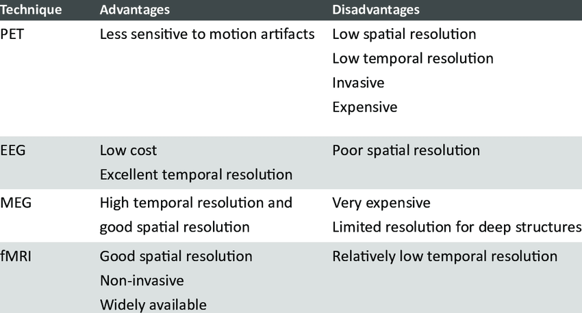

# What is an MRI and how does it work?

MRI stands for **Magnetic Resonance Imaging**, which probably doesn't mean much to you now but will by the end of this module! 

If you bet that I was going to actually be the one writing all of this material, then you would probably lose that bet. This article does a good job at explaining how an MRI works and if a lot of it doesn’t make sense, that is *okay*. You do *not* need to be an MRI physicist by the end of this but just have a basic idea of how we go from putting a person in the scanner to looking a pretty image of their brain:

**[Magnetic resonance imaging (MRI) (article) - Khan Academy](https://www.khanacademy.org/science/biology/human-biology/neuron-nervous-system/a/magnetic-resonance-imaging-mri)**

Now that you have read some about how an MRI works, these videos are great for reinforcing the concepts through helpful animations since not everyone intuitively imagines what proton precessions look like(by not everyone, I mean no one). The videos below are in order of increasing level of detail(aka the top is easiest and the bottom is the hardest) since there will be people with different levels of background knowledge.

- **[MRI in 10 Minutes!](https://youtu.be/jLnuPKhKXVM?si=K08V18WdL5oLSaco)** This is all you need. It can give you a basic idea of how exactly an MRI works. Since it would be pretty embarrassing to say you work with MRIs but when asked how they work, have no idea and pretend you do until you cave and admit to them you just work with the data and don’t know…who would ever get caught in that situation? 
- **[MRI in Just Under 10 Minutes!](https://youtu.be/1Ku6-uXw7Ag?si=eUFo5yEXmpEOQl4f)** This is a slightly less fun version of the video above, but it does do a better job at explaining the physics behind MRIs which for anyone who’s more of a math/science type of student.
- **[Super In Detail For the Engineers](https://youtube.com/playlist?list=PLkSVzqeK5v2C4X1G3IuRUQeNveNGNxZrn&si=2QvvOv37GIvj9gUC)**: Unless you have a strong physics and mathematics background and a few hours time, don’t bother torturing yourself with this(the lack of exclamation point in the title is telling). This is very in detail on the mechanisms/equations that drive how an MRI is taken. 

MRI is a very useful imaging modality since it *does* ***not*** *expose the subject to radiation* like some other imaging modalities such as **PET**, **CT**, and **X-Ray**. Not only that, but it offers a good combination of **spatial resolution** and **temporal resolution**. 
  - Spatial resolution is a measure of how small of pieces we can break up the image into
      - It is the same as number of pixels used for a video or image
          - Having less pixels, such a 360p video, looks much blockier and blurrier than a high definition with more pixels, 1080p video
          - If you do not know what 360p and 1080p means, go on  youtube and look at the settings on the bottom right of your video. You can change the quality of the video to whichever you chose and will be able to see a visible difference in clarity
      - MRI's are 3D images that use **voxels** instead of pixels.
          - *Voxels* are just 3-dimensional pixels. They are the tiny cubes that each have a measured intensity from the scan, and therefore show up in the image with that intensity. 

While MRI is a very versatile tool for imaging, some other important imaging methods such as **EEG**, **MEG**, and **PET** scans are also used and each has their own pros and cons(as previewed in the graphic *below*). As you continue to learn, you will see that some imaging methods are better suited for some types of studies. 

Image from:

Mendez Orellana, Carolina. (2015). Functional MRI of Language Processing and Recovery. 
https://www.researchgate.net/publication/295856844_Functional_MRI_of_Language_Processing_and_Recovery. 

  <a href="fmri_bold_signal.html">Next Page (fMRI/The BOLD Signal)</a>

 

  <a href="/fmri-for-beginners/">Home</a>

